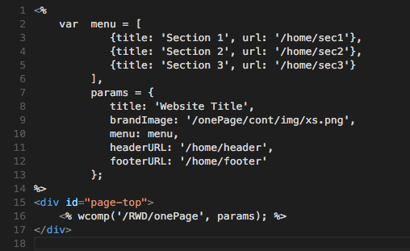
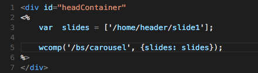
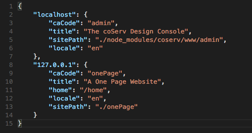

How To Modify This Demo
=======================

This article will show you how to modify this demo and make it your own one-page RWD website.

## The home page
The default page of this website is set to '/home', so let's start with the '/home' page. You can find out the related files in the [$root/onePage/themes/onePage/blocks/views/home](https://github.com/benlue/cows-onePage/tree/master/onePage/themes/onePage/blocks/views/home) directory (where $root is the install directory of this project). Below is the HTML code:

As you can see, it simply invokes a wcomp ('/RWD/onePage') with customizing parameters. Those parameters are:

+ **title**: line #7. This is the branding title shown in the page header. You can change it to your website title.
+ **brandImage**: line #8. This is the branding image next to the title. Again, you can change it to your own logo. It's recommended you put your logo image in the '$root/onePage/cont/img' direcotry.
+ **menu**: line #9. This will be the page menu showning in the upper right corner of the page. The 'menu' property is an array with each element contaiing the title (which will be shown on the page) and the path to a block.

The 'menu' property is an array as explained above. Each element in the array is a menu item with two properties:

+ **title**: this is the text to be displayed on the header menu.
+ **url**: this is the path or name of a block. In the example shown above, the first menu item will link to the '/home/sec1' block. You can find out the block in the [$root/onePage/themes/onePage/blocks/views/home/sec1](https://github.com/benlue/cows-onePage/tree/master/onePage/themes/onePage/blocks/views/home/sec1) directory.

Now you know if you want to change the contents of those three sections in the page, you should simply go to the '/home/sec1', '/home/sec2' and '/home/sec3' blocks to change the contents there.

### The heading section
Okay, so we can change those page sections but how about the heading section? The heading section is specified in line #11. You can modify its source in this directory: [$root/onePage/themes/onePage/blocks/views/home/header](https://github.com/benlue/cows-onePage/tree/master/onePage/themes/onePage/blocks/views/home/header).

The header HTML file needs a little explanation. Let's show its source code below:

As shown in the source code, the heading section invokes a '/bs/carousel' wcomp which is nothing more than a bootstrap carousel. The demo uses just one slide and that slide is represented by the '[/home/header/slide1](../themes/onePage/blocks/views/home/header/slide1)' block. You can add more slides to the carousel heading by adding blocks to the slides array.

### Where is wcomp
In this short article, we mentioned several times about wcomp. You can find the source codes of wcomps in [this directory](https://github.com/benlue/cows-onePage/tree/master/onePage/wcomp).

## Settings
This website is implemented by coServ. coServ can host multiple websites at the same time, so you need to tell coServ some basic info about your website. This is done by the sites.json file which is located in the install directory.

If you just want to try this website on your machine, the setting should be fine. If you have modify the website to be your own and want to publish it to the outside world, you'll have to change the domain name of the website. In line #8 of the sites.json file, replace "127.0.0.1" with the actual domain name and that should do it.